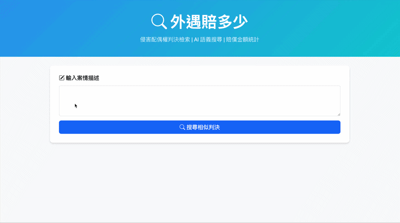
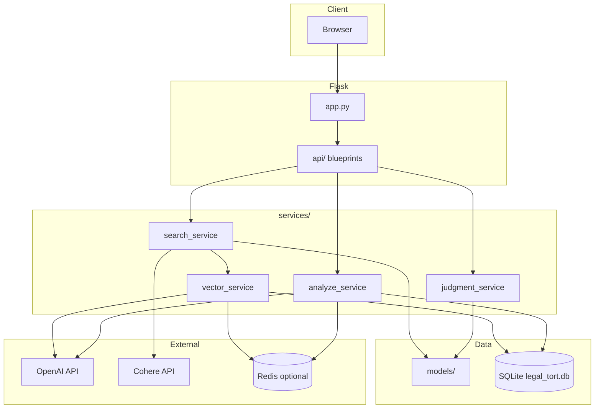
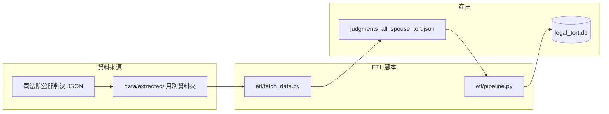
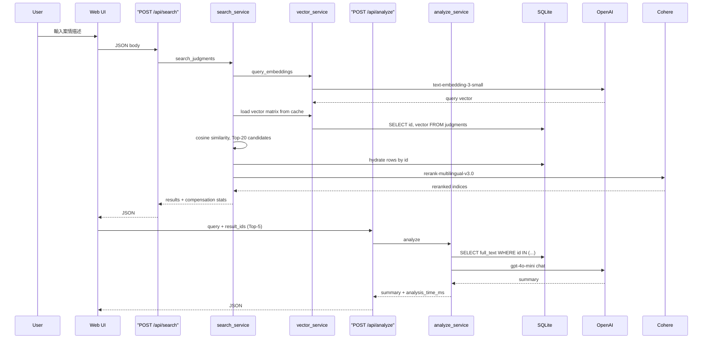

# 外遇賠多少 - 侵害配偶權判決 AI 檢索系統


⚡ 為執業律師打造的智慧判決檢索系統

本專案是基於執業律師經驗，為了解決法律實務中的痛點而設計與實作，將非結構化判決，轉成可搜尋、可分析的法律資料產品。  
MVP 以「侵害配偶權」為主，未來可擴充至其他訴訟類型。

## Table of Contents
- [Demo](#demo)
- [About the Project](#about-the-project)
  - [Why This Project](#why-this-project)
  - [Core Features](#core-features)
  - [Tech Stack](#tech-stack)
- [Engineering Highlights](#engineering-highlights)
- [System Design & Architecture](#system-design--architecture)
- [Key Technical Decisions](#key-technical-decisions)
- [Getting Started](#getting-started)
- [API Endpoints](#api-endpoints)
- [Future Work & Limitations](#future-work--limitations)
- [Disclaimer](#disclaimer)

---

## Demo



---

## About the Project

### Why This Project

在侵害配偶權案件中，律師常常需要回答幾個問題：
- 類似案情，法院通常怎麼認定？
- 賠償金額大致落在哪個區間？
- 有哪些關鍵證據組合？

傳統做法仰賴關鍵字搜尋、人工閱讀與個人經驗，相當耗時。本專案的核心目標，是把「律師搜尋及分析判決」系統化，讓使用者輸入案情敘述後，可以快速找到語意最接近的判決，並得到可用於初步分析的「賠償金額統計」與「判決分析摘要」。

### Core Features

- **兩階段語意搜尋**：先以向量相似度召回候選判決，再以 Cohere Rerank 依案情語意重排，回傳最相關的判決
- **賠償統計**：自動整理 Top-K 搜尋結果的中位數、平均數、最高與最低賠償金額
- **判決詳情**：可查看單一判決的事實摘要、理由摘要、證據類型與判決全文
- **AI 分析**：針對最相關的判決，生成精簡的法院見解分析與風險提示

### Tech Stack

- **Backend:** [Python](https://www.python.org/), [Flask](https://flask.palletsprojects.com/), [Pydantic](https://docs.pydantic.dev/)
- **Data & AI:** [SQLite](https://www.sqlite.org/), [NumPy](https://numpy.org/), [OpenAI API](https://openai.com/) (Embedding: `text-embedding-3-small`, LLM: `gpt-4o-mini`), [Cohere API](https://cohere.com/) (Rerank: `rerank-multilingual-v3.0`)
- **Infrastructure & Cache:** [Docker](https://www.docker.com/), [Gunicorn](https://gunicorn.org/), [Google Cloud Run](https://cloud.google.com/), [Redis](https://redis.io/)
- **Frontend:** [Jinja](https://jinja.palletsprojects.com/), [Bootstrap](https://getbootstrap.com/), [JavaScript](https://developer.mozilla.org/en-US/docs/Web/JavaScript) (Vanilla JS，以 `fetch` 呼叫 API 並動態更新 UI)
- **QA & CI/CD:** [Pytest](https://pytest.org/), Ruff, [GitHub Actions](https://github.com/features/actions)

---

## Engineering Highlights

- **定義問題**：從法律實務工作流中抽出可被軟體解決的核心問題。
- **後端設計與 API 化**：使用 Pydantic 嚴格驗證 API request / response，並拆分 API、服務層、資料層，確保系統容易維護與測試。
- **資料工程與自動化 (ETL)**：將原始 JSON 判決進行篩選、清洗與結構化，建立可搜尋的高品質資料集。
- **測試與 CI**：具備 unit tests 與 integration tests，並透過 GitHub Actions 在推播時自動執行 Ruff linter 與 Pytest。
- **效能與防護**：
  - 使用 Redis 快取 Embedding 生成結果，降低 API 呼叫次數。
  - 搜尋流程採 **Recall → Rerank**：向量先取 Top-20 候選，再以 Cohere 重排為 Top-10，改善純 cosine 相似度與 query 爭點不符的問題。
  - 對 AI 分析 endpoint 加入 rate limiting (透過 **Flask-Limiter**)，避免惡意濫用導致成本失控。
  - 支援容器化 (Docker/Gunicorn) 部署設計。

---

## System Design & Architecture

與架構圖對應的專案目錄設計：
- `app.py` 與 `api/` 為入口與路由；
- `services/` 涵蓋核心邏輯 (搜尋、向量、分析與判決讀取)；
- `models/` 與 SQLite 負責資料結構；
- `etl/` 執行資料萃取與正規化；
- `templates/`、`static/` 提供 Web UI；
- `tests/` 進行單元與整合測試。

### 1. Architecture Diagram


*(註：`data/`、`legal_tort.db`、log 檔等屬於本地資料或建置產物，不會上傳至版本庫。)*

### 2. ETL Data Flow

在系統啟動前，判決資料必須先經過萃取。我們將非結構化的判決萃取為結構化欄位與 Embedding 並寫入 SQLite。產出之 db 為應用程式單一資料來源，系統啟動時會載入向量快取以加速查詢。



### 3. Request Flow (Search and Analyze)

由使用者搜尋到產生 AI 結論的完整互動過程：



---

## Key Technical Decisions

### 1. **限縮領域與成本限制**

- Context (法律)：
捨棄使用全部判決資料，選擇先專注於「侵害配偶權」。相較於複雜的重大刑事案件或工程案件，侵害配偶權的案件類型相似度高，且單篇判決不至於過長。法院在衡量賠償金額時，會審酌侵害行為、時間、兩造身分地位及資力等，具有相對明顯的量化指標。
- Solution (工程)：
實作`fetch_data` → `pipeline`，先以關鍵字在 JSON 裡批次**篩選侵害配偶權案件，再進入昂貴的結構化萃取與向量計算**，縮小集合以避免模型成本耗在明顯無關的判決上。
- Trade-off：
規則要維護、邊界案例可能漏抓或誤抓。

### 2. **ETL 降噪與結構化萃取**

- Context (法律)：
若將整篇判決書直接做向量計算會太長，且判決有許多重複的內容，例如幾乎所有侵害配偶權判決都會提到「故意不法侵害」、「致生原告精神上之痛苦」，及民法184的條文，故，以判決全文計算出來的向量可能會在向量空間內過度集中，並導致關鍵資訊被稀釋。
- Solution (工程)：
先以 LLM 從判決全文萃取**事實摘要**、**理由摘要**、**證據類型清單**，並搭配賠償金額等結構化欄位，再將「案情摘要 + 理由摘要 + 證據類型」組成用於向量化的文字，呼叫 embedding 寫入資料庫；第一階段語意搜尋便是對這批摘要計算出的向量做相似度檢索，全文則另外保留給判決詳情頁及第二階段生成判決分析時使用。
- Trade-off：
ETL prompt 必須嚴謹，否則若摘要不精準就會污染結果。

### 3. **降低體感延遲的非同步架構**

- Context：
LLM 生成綜合分析的等待時間需要超過十秒，若採用單一 API 同步等待所有結果，會導致使用者體驗不佳。
- Solution (工程)：
拆分為兩段式流程，`POST /api/search` 先回傳 Top-K 判決與賠償統計，前端再非同步呼叫 `POST /api/analyze`。
- Trade-off：
前端要分別處理搜尋與分析的成功／失敗與載入狀態；好處是即便分析失敗，使用者仍看得到已完成的相似判決與統計。

### 4. **兩階段檢索：向量召回 + Cohere Rerank**

- Context (法律)：
僅靠 embedding cosine 相似度時，有時會召回「用詞相近但爭點不同」的判決。
- Solution (工程)：
`search_service` 先以向量相似度取 `first_top_k`（預設 20）筆候選，再將「事實摘要 + 理由摘要 + 證據類型」組成文件，呼叫 Cohere `rerank-multilingual-v3.0` 重排為 `final_top_k`（API 預設回傳 10 筆）；賠償統計與前端列表皆依 rerank 後結果計算。
- Trade-off：
每次搜尋多一次 Cohere API 呼叫與延遲；需設定 `COHERE_API_KEY`。

### 5. **MVP 階段的輕量化資料庫選型**

- Context：
此階段的核心目標是驗證「以案情檢索類似判決及賠償區間」的流程，而非追求極致的分散式系統。  
- Solution (工程)：
將關聯資料與 Embedding 向量同庫存入輕量級 SQLite，並隨 Docker 容器化部署至 Cloud Run。以單一 `legal_tort.db` 降低雲端固定成本，向量以 BLOB 儲存、線上載入為矩陣做相似度計算。
- Trade-off：
現階段達成「零資料庫託管成本」與「容器內零網路延遲」，但未來資料規模增長時，恐會面臨記憶體不足與冷啟動時間過長問題。

---

## Getting Started

<details>
<summary>1. 安裝環境與依賴</summary>

```bash
python3 -m venv venv
source venv/bin/activate
pip install -r requirements.txt
```
如果需要使用開發工具 (Ruff) 與進行測試：
```bash
pip install -r requirements-dev.txt
```
</details>

<details>
<summary>2. 設定環境變數</summary>

在專案根目錄建立 `.env`：
```bash
OPENAI_API_KEY=your_api_key
COHERE_API_KEY=your_cohere_api_key
SECRET_KEY=dev-secret-key
REDIS_URL=rediss://...
```
*(註：`REDIS_URL` 為選填。若未提供，Rate limit 容量與快取將預設回退至 memory 執行。`COHERE_API_KEY` 為搜尋 rerank 所需。)*
</details>

<details>
<summary>3. 資料管線處理 (若無匯入好之 DB)</summary>

系統需要有 `legal_tort.db` 才能運作。請依以下步驟執行：

**Step 1: 篩選原始判決資料**

從司法院公開判決資料中，批次篩選侵害配偶權相關民事判決，輸出為整合後的 JSON 檔：

> 註：由於司法院原始判決檔案龐大，此 repo 未包含原始檔。若需測試 ETL 流程，請自行準備司法院 JSON 格式樣本放入 `data/extracted/`。
> 司法院資料開放平台：[https://opendata.judicial.gov.tw/dataset?categoryTheme4Sys%5B0%5D=051&sort.publishedDate.order=desc&page=1#](https://opendata.judicial.gov.tw/dataset?categoryTheme4Sys%5B0%5D=051&sort.publishedDate.order=desc&page=1#)

```bash
python etl/fetch_data.py
```

**Step 2: 建立結構化資料與向量**

```bash
python etl/pipeline.py
```

將判決萃取為結構化欄位與 embedding 並寫入 SQLite，產出後應用程式以該庫為單一資料來源，啟動時載入向量快取以加速查詢。
</details>

<details>
<summary>4. 本機執行服務</summary>

```bash
python app.py
```
> 開啟 [http://localhost:8080](http://localhost:8080)
</details>

<details>
<summary>5. Testing (單元與整合測試)</summary>

```bash
ruff check .
pytest tests/ -v
```
</details>

<details>
<summary>6. Docker 與 GCP 部署</summary>

**使用 Docker Compose 啟動:**
```bash
docker compose up --build
```

**部署至 GCP Cloud Run (Serverless 架構):**
本系統利用 `.gcloudignore` 包含 SQLite db 進入容器，由 Upstash Redis 處理外部狀態。
先於主控台建立 Secrets Manager (`OPENAI_API_KEY`, `COHERE_API_KEY`, `REDIS_URL`)，然後以 GCP CLI 發佈：

```bash
gcloud config set project YOUR_GCP_PROJECT_ID

gcloud run deploy legal-rag-tort \
  --source . \
  --region=asia-east1 \
  --allow-unauthenticated \
  --set-secrets=OPENAI_API_KEY=OPENAI_API_KEY:latest,COHERE_API_KEY=COHERE_API_KEY:latest,REDIS_URL=REDIS_URL:latest \
  --set-env-vars=SECRET_KEY=replace-with-a-long-random-string
```
</details>

---

## API Endpoints

| Method | Endpoint | Description |
|--------|----------|-------------|
| `POST` | `/api/search` | 輸入案情描述，回傳相似判決與統計 |
| `POST` | `/api/analyze` | 針對搜尋結果的判決全文產生 AI 分析 |
| `GET`  | `/api/judgment/<id>` | 取得單一判決詳細內容 |
| `GET`  | `/api/health` | 檢查資料庫、向量快取與 Redis 狀態 |

---

## Future Work & Limitations

### Data Scope and Limitations
- **案件類型**：聚焦於「侵害配偶權」相關民事判決。
- **資料期間**：目前 demo 網站的資料係以 2024 年 1 月 - 2025 年 10 月判決為主。
- **限制**：系統提供的是資料整理與相似案例輔助，**不能取代個案法律判斷**。由於依賴 OpenAI 分析，需注意使用量與 Token 成本問題。

### Future Roadmap
- **優化 RAG 檢索框架**：
   - 評估 Hybrid Search (Semantic + Keywords) 以減少誤召回。
- **精進 Prompt Engineering**：
   - 將 Prompt 版控化並進行 A/B 測試。
   - 規劃在 Prompt 加入法律用語之理解（如「按查惟故」），增加分析的精準性。
- **可觀測性與評估指標**：
   - 為向量搜尋與 LLM Request 導入系統化的 Log（Latency/Token Usage/Cost Tracking），增強問題除錯與追溯能力。
   - 建立基準測試資料集 (Baseline Evaluation)，以 `Recall@K` 或 LLM as a Judge 量化模型改版帶來的影響。

---

## Disclaimer
本系統僅供研究、學習與法律資訊整理使用，不構成法律意見。具體案件仍需依個案事實、最新實務見解與專業法律判斷為準。